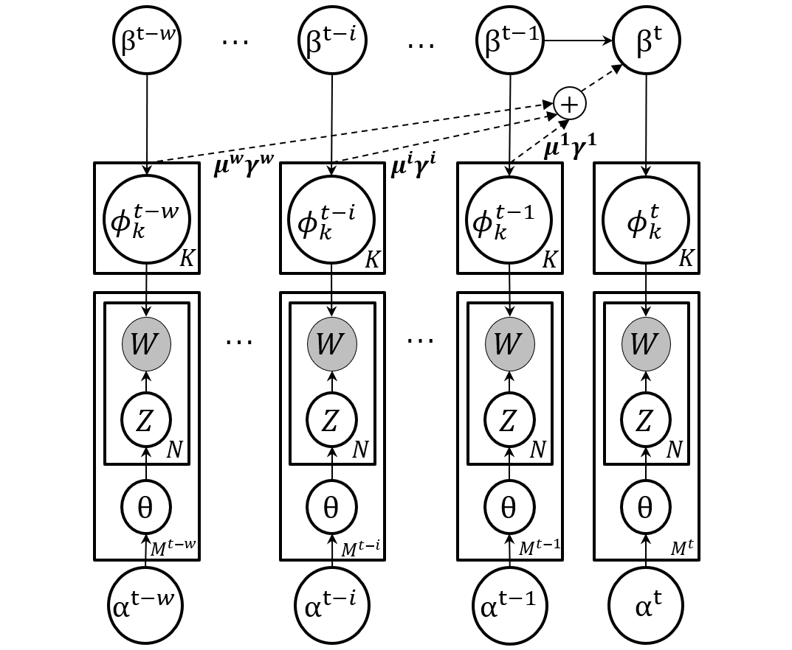

# IEDL
In this project, we propose a novel online topic tracking framework, named IEDL, for tracking
the topic changes related to deep learning techniques on Stack Exchange and automatically in-
terpreting each identified topic.  The proposed framework combines the prior topic distributions
in a time window during inferring the topics in current time slice, and introduces a new ranking
scheme to select most representative phrases and sentences for the inferred topics.  Experiments
on 7,076 Stack Exchange posts show the effectiveness of IEDL in tracking topic change

<p align="center"></p>

This project is based on the work of [IDEA](https://github.com/ReMine-Lab/IDEA)

> Fenglei JIN, Cuiyun Gao, Michael Lyu. An Online Topic Modeling Framework with Topics Automatically Labeled.


## Input Data Format
Input raw posts should be saved as the following format per line. The attributes are separated by `******`. The number of attributes should be claimed in the variable `InfoNum` under the `[Info]` section. Here, `InfoNum=10`. And all data preprocess files are in the `data` file. And to show the quality of topic distribution, we train a SVM based on 507 maually labeld data. All raw datas are in `data/rawdata` file and can be directly downloaded from the Internet: [Dataset](https://archive.org/download/stackexchange).

```
rating******review text******title******date******version******views
```

## Usage
1. Install python dependence packages for IEDL:

```
$ cd IEDL/
$ ./install.sh
```
IEDL is built on Python2.7 (and some prepocessing parts are based on Python 3.6) under Ubuntu, add `sudo` before the installation command if you need administrator permission.

2. **Notice:** If this is the first time to use IEDL in your computer, you need to compile pyx and c. Also make sure `_lda.c` and `_lda.so` have been deleted before running the command (you are suggested to delete these files and rebuild on your computer):

```
$ cd src/
$ python build_pyx.py build_ext --inplace
```

3. Run the main program using the preprocessed data. This may take several minutes.

```
$ ./run normal			//for the orginal IDEA approach
$ ./run test			//for the testing accuracy based on manually labeled data
$ ./run views			//for the new approach based on views attribute
```

One can modify the parameters for the inputs and outputs in `config.ini` easily (modify `DecayFlag` to show power of exponential decay). The outputs will be stored in `result/`. And for `normal` approach and `views` approach, we can find the topic coherence in 
`topic_cohe/results/score-topics-words.txt`.

## Visualization
1. The source code for visualization is under the folder `visualization`. To prepare the input for visualization, we first run

```
$ python get_input <result_folder> <topic_number>

result_folder ----- the output dir of IEDL, e.g., '../result/post/'
topic_nubmer  ----- the number of topics
```

2. Use localhost server to display the topic river. For Python 2, run `$ python -m SimpleHTTPServer 7778`, while for Python 3, run `python -m http.server 7778`. `7778` is the port number for viewing the visualization, e.g., for localhost, here we type `localhost:7778` in the browser.

You can see a demo directly by enter [demo](http://appsrv.cse.cuhk.edu.hk/~fljin7/fyp_term2/index.html).

## History
2019-5-4: first version of IEDL
